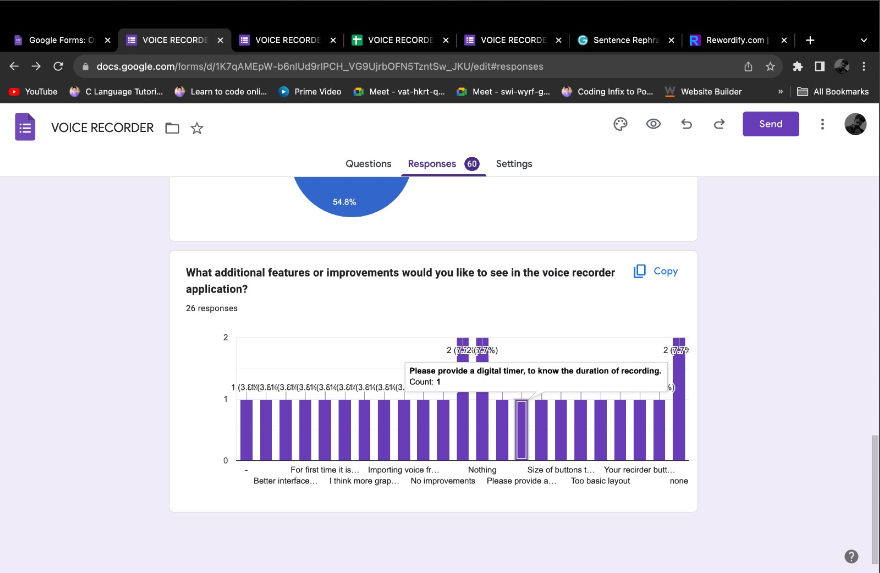

# Devops_VoiceRecorder

Welcome to the Voice Recorder App! This app allows users to record audio on their devices effortlessly.Our app provides a user-friendly experience.
Simple Interface: Intuitive user interface for easy navigation.
Recording: Record audio with a single tap.
Pause and Resume: Pause and resume recording sessions.
Save and Manage Recordings: Organize and manage your recordings with ease.
Playback: Listen to your recordings directly from the app.

Agile Methodology
We follow Agile development principles to ensure continuous improvement and responsiveness to customer feedback. Our development process includes:

Usage
Recording:

Open the app and click the "Record" button to start recording.
Click "Pause" to pause the recording if needed.
Click "Stop" to finish the recording.
Playback:

Navigate to the "Recordings" section to see your saved recordings.
Click on a recording to play it.
Sharing:

To share a recording, select it and choose the "Share" option.
Follow the prompts to share via email or other apps.
Contributing
We welcome contributions to improve the Voice Recorder App. To contribute:

Fork the repository.
Create a branch for your feature or bug fix.
Make your changes and commit them.
Create a pull request with a clear description of your changes.

FIRST OUTCOME OF OUR PROJECT

SECOND OUTCOME OF OUR PROJECT WITH SOME UPDATION

Third OUTCOME OF OUR PROJECT WITH SOME UPDATION

Fourth iteration of our project

Fifth and final iteration after taking suggestion from one of the feedback

Feedback:
